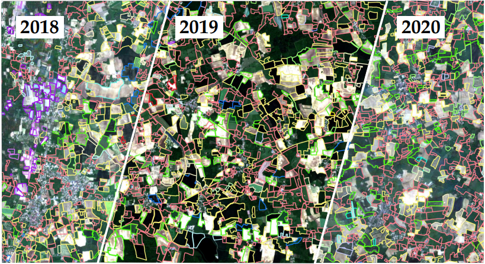

# Deep Crop Rotation

Paper (to come very soon!)

We propose a deep learning approach to modelling both inter- and intra-annual patterns for parcel classification. Our approach, based on the [PSE+LTAE](https://github.com/VSainteuf/lightweight-temporal-attention-pytorch) model, provides a significant performance boost of +6.6 mIoU compared to single-year models. We release the first large-scale multi-year agricultural dataset with over 100 000 annotated parcels for 3 years: 2018, 2019, and 2020.

  

## Requirements
 - PyTorch + Torchnet
 - Numpy + Pandas + Scipy + scikit-learn 
 - pickle
 - os
 - json
 - argparse
 
 The code was developed in python 3.7.7 with pytorch 1.8.1 and cuda 11.3 on a debian, ubuntu 20.04.3 environment.
 
## Downloads
 
### Multi-year Sentinel-2 dataset
You can download our Multi-Year Sentinel-2 Dataset [here](https://zenodo.org/record/5535882). 

## Code
This repository contains the scripts to train a multi-year PSE-LTAE model with a spatially separated 5-fold cross-validation scheme. 
The implementations of the PSE-LTAE can be found in `models`. 

Use the `train.py` script to train the 130k-parameter L-TAE based classifier with 2 years declarations and multi-year modeling (2018, 2019 and 2020). 
You will only need to specify the path to the dataset folder:

`python3 train.py --dataset_folder path_to_multi_year_sentinel_2_dataset`

If you want to use a specific number of year for temporal features add: `--tempfeat number_of_year` (eg. `3`)

Choose the years used to train the model with: `--year` (eg. "['2018', '2019', '2020']")

### Pre-trained models

Two pre-trained models are available in the `models_saved` repository: 
- Mdec: Multi-year Model with 2 years temporal features, trained on a mixed year training set.
- Mmixed: singe-year model, trained on a mixed year training set.

Use our pre-trained model with: `--test_mode true --loaded_model path_to_your_model --tempfeat number_of_years_used_to_train_the_model`

## Use your own data

If you want to train a model with your own data, you need to respect a specific architecture:
  - A main repository should contain two sub folders: `DATA` and `META` and a normalisation file.
  - META: contains the `labels.json` file containing the ground truth, `dates.json` containing each date of acquisition and `geomfeat.json` containing geometrical features (dates.json and geomfeat.json are optional).
  - DATA: contains a sub folder by year containing a .npy file by parcel.

Each parcel of the dataset must appear for each year with the same name in the DATA folder.
You must specify the number of acquisitions in the year that has the most acquisitions with the option `--lms length_of_the_sequence`.
You also need to add your own normalisation file in train.py 

## Credits 
 - The original PSE-LTAE model adapted for our purpose can be found [here](https://github.com/VSainteuf/lightweight-temporal-attention-pytorch)
